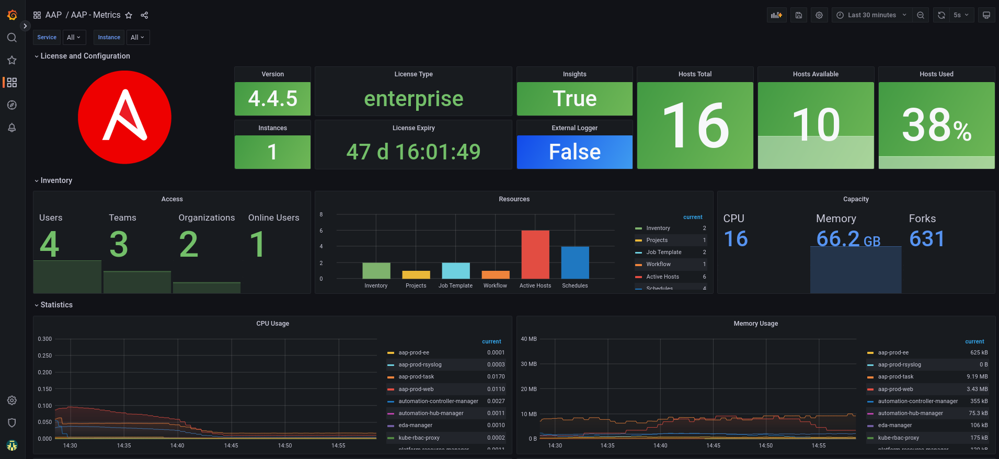

# Ansible Automation Platform - Dashboard


- To install this dashboard on Grafana Operator

```shell
cat << EOF > grafana-aap-dashboard.yaml
apiVersion: grafana.integreatly.org/v1beta1
kind: GrafanaDashboard
metadata: 
  name: grafana-dashboard-aap
  labels: 
    app: grafana
spec:
  instanceSelector:
    matchLabels:
      dashboards: grafana  
  folder: "AAP"      
  url: https://raw.githubusercontent.com/leoaaraujo/aap-dashboard/main/aap-dash.json
EOF

oc create -f grafana-aap-dashboard.yaml -n openshift-user-workload-monitoring
```


&nbsp;




